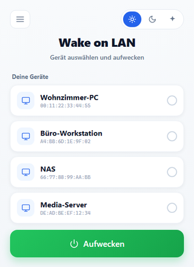
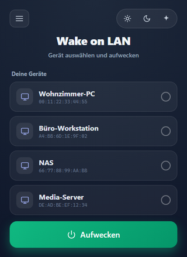
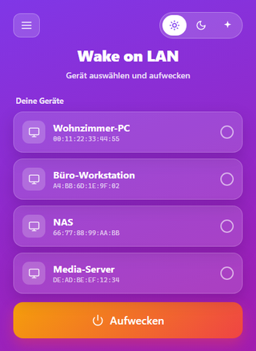
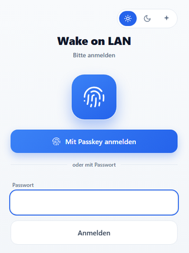
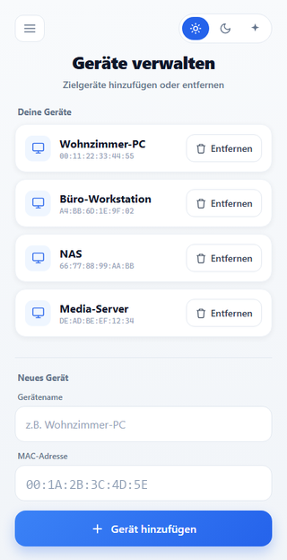
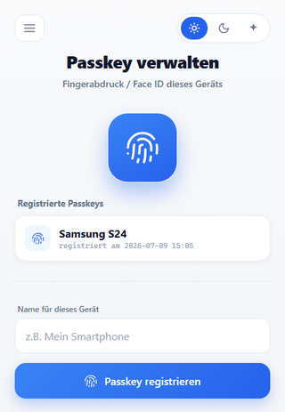

# WOL mit Passkey-Login

*[English version](README_en.md)*

Eine schlanke Wake-on-LAN-Weboberfläche für den Heimgebrauch – mit modernem
**Passkey-Login (Fingerabdruck / Face ID)** statt nur Passwort. Ein Ordner PHP,
keine Datenbank, kein Composer, keine Build-Tools: hochladen, Passwort setzen, fertig.

Vom Smartphone aus: Seite öffnen → Finger auflegen → Rechner aufwecken.

## Screenshots

Drei umschaltbare Designs (Standard ist **Hell**):

| Hell | Dunkel | Bunt |
|:---:|:---:|:---:|
|  |  |  |

| Login mit Passkey | Geräte verwalten | Passkeys verwalten |
|:---:|:---:|:---:|
|  |  |  |

## Funktionen

- 🖥️ **Wake on LAN**: weckt Rechner im Heimnetz per Magic Packet (UDP-Broadcast)
- 🔐 **Login-Schutz**: Passwort-Login mit Sperre nach zu vielen Fehlversuchen
- 👆 **Passkeys (WebAuthn)**: Anmeldung per Fingerabdruck/Face ID, pro Gerät registrierbar;
  auf bekannten Geräten startet die Abfrage beim Öffnen der Seite automatisch
- 🎨 **Drei Designs**: Hell, Dunkel und Bunt – jederzeit über den Umschalter oben rechts
  wählbar, die Wahl wird pro Browser gemerkt
- 🌍 **Mehrsprachig**: Deutsch und Englisch, umschaltbar im Hamburger-Menü;
  beim ersten Besuch wird die Browsersprache erkannt. Weitere Sprachen sind
  leicht ergänzbar (siehe [Sprache hinzufügen](#eine-sprache-hinzufügen))
- 📱 **Für Smartphones optimiert**: grosse Buttons, antippbare Gerätekacheln,
  Navigation im Hamburger-Menü
- ⚙️ **Geräteverwaltung im Browser**: Zielgeräte (Name + MAC) hinzufügen und entfernen,
  ohne Dateien zu editieren
- 🔁 **Reverse-Proxy-tauglich**: funktioniert hinter gängigen Reverse Proxies
  (Nginx Proxy Manager, Traefik, Caddy, der Reverse-Proxy in Synology DSM u.ä.)
- 🗂️ **Keine Datenbank**: alle Daten liegen in selbstschützenden Dateien im Ordner `auth/`

## Voraussetzungen

- PHP **8.0 oder neuer** mit den Extensions **openssl** und **sockets**
  (kein mbstring, kein Composer nötig)
- Ein Webserver (Apache, nginx, Caddy, ... – oder ein fertiges Paket wie
  XAMPP, ein Docker-PHP-Image oder die Web Station eines NAS)
- **HTTPS** mit gültigem Zertifikat – ohne HTTPS verweigert der Browser Passkeys
- Der Server muss **im selben LAN** stehen wie die aufzuweckenden Geräte
  (Magic Packets sind Broadcasts und verlassen das lokale Netz nicht –
  ein gemieteter Webspace im Internet funktioniert daher nicht)
- Docker: nur mit `network_mode: host`, sonst kommen die Broadcasts nicht ins LAN

## Installation

> **Tipp:** Am einfachsten das fertige Installations-ZIP von der
> [Releases-Seite](https://github.com/brunoz78/wol-passkey/releases/latest)
> herunterladen (`wol-passkey-<version>.zip`). Es enthält nur die für den Betrieb
> nötigen Dateien – ohne Screenshots, Entwicklungs-Dateien usw. Der „Source
> code"-Download enthält dagegen das komplette Projekt und ist für die
> Installation nicht nötig.

1. Das Installations-ZIP herunterladen, entpacken und den **Inhalt** des Ordners
   in ein Verzeichnis des Webservers hochladen
2. `config.sample.php` nach `config.php` kopieren und anpassen:
   - `$setup_key`: **einen eigenen langen Zufallswert eintragen** (z.B. aus dem
     Passwort-Manager). Wer diesen Schlüssel kennt, kann das Login-Passwort
     zurücksetzen – geheim halten!
   - `$networkbroadcast`: Broadcast-Adresse des Heimnetzes
     (Netz `192.168.1.x` → `192.168.1.255`)
   - `$maclist`: optional erste Zielgeräte eintragen (später bequem über die
     Weboberfläche pflegbar)
3. Dem Webserver-Benutzer **Schreibrechte auf den Ordner `auth/`** geben
   (Linux z.B. `chown www-data auth/` bzw. `chmod`; bei einem NAS über den
   Datei-Manager dem Web-Benutzer, meist Gruppe `http`, Lese-/Schreibrecht geben)
4. `https://deine-domain/setup.php` aufrufen, Setup-Schlüssel eingeben und
   Login-Passwort setzen
5. Anmelden und unter **„Passkey verwalten"** den Fingerabdruck des Geräts
   registrieren – ab dann geht der Login ohne Passwort

## Betrieb hinter einem Reverse Proxy

Passkeys sind an die Domain gebunden, die im Browser steht. Damit der Server
diese Domain kennt, muss der Proxy zwei Header mitschicken:

**Nginx Proxy Manager** (Custom Location bzw. Advanced-Tab):

```nginx
location / {
    proxy_pass http://192.168.1.10/wol/;
    proxy_set_header X-Forwarded-Host $host;
    proxy_set_header X-Forwarded-Proto $scheme;
}
```

Bei anderen Reverse Proxies dieselben zwei Header setzen. Beispiel
**Synology DSM**: Systemsteuerung → Anmeldeportal → Erweitert → Reverse Proxy →
Eintrag bearbeiten → Benutzerdefinierte Kopfzeile → `X-Forwarded-Host` = `$host`
und `X-Forwarded-Proto` = `$scheme`.

Ohne diese Header erscheint bei der Passkey-Registrierung die Fehlermeldung
*„The relying party ID is not a registrable domain suffix of, nor equal to the
current domain"*.

**Wichtig:** Ein Passkey gilt nur für die Domain, unter der er registriert
wurde. Die Seite also immer über dieselbe Adresse aufrufen (Lesezeichen!).

## Sicherheitshinweise

- Die Anwendung ist bewusst ein **Ein-Benutzer-System** für den Heimgebrauch:
  ein gemeinsames Passwort, eine gemeinsame Passkey-Liste – keine Benutzerkonten,
  keine Rollen
- `config.php` (enthält den Setup-Schlüssel) niemals veröffentlichen;
  sie steht deshalb in der `.gitignore`
- Die Datendateien in `auth/` (Passwort-Hash, Passkey-Schlüssel, Geräteliste)
  schützen sich selbst gegen direkten Web-Zugriff (403). Die mitgelieferten
  `.htaccess`-Dateien blockieren die Ordner auf Apache zusätzlich; auf nginx
  empfiehlt sich analog:

  ```nginx
  location ~ ^/(auth|lib|lang)/ { deny all; }
  ```

- Nach 5 falschen Passwort-Versuchen wird das Login 5 Minuten gesperrt
  (einstellbar in `auth/config.php`)
- Passwort vergessen? `setup.php` aufrufen und mit dem Setup-Schlüssel ein
  neues setzen

## Eine Sprache hinzufügen

Die Texte liegen als einfache PHP-Arrays im Ordner `lang/`. Eine neue Sprache
braucht keine Code-Änderung an den Seiten:

1. `lang/de.php` nach `lang/<code>.php` kopieren (z.B. `lang/fr.php`)
2. Die Texte rechts vom `=>` übersetzen
3. Den Code in `auth/i18n.php` bei `i18n_languages()` eintragen:

   ```php
   return [
       'de' => 'Deutsch',
       'en' => 'English',
       'fr' => 'Français',
   ];
   ```

Fehlt in einer Sprachdatei ein Text, wird automatisch der deutsche verwendet
(Deutsch ist die Ausgangssprache). Die gewählte Sprache wird in einem Cookie
gemerkt; beim ersten Besuch entscheidet die Browsersprache, sonst Englisch.

## Release-ZIP selbst bauen

Das Installations-ZIP (nur die für den Betrieb nötigen Dateien) wird mit einem
mitgelieferten Skript erzeugt – plattformübergreifend mit korrekten
Vorwärts-Schrägstrichen (wichtig fürs Entpacken auf Linux/NAS):

```bash
php tools/build-release.php 1.0.1
```

Ergebnis: `dist/wol-passkey-1.0.1.zip`. Das Skript schliesst automatisch die
geheime `config.php`, Screenshots und Entwicklungs-Dateien aus und bricht ab,
falls versehentlich ein Geheimnis im Archiv landen würde. Die Versionsnummer im
Dateinamen ist das Argument.

Anschliessend an ein GitHub-Release anhängen – entweder über die Weboberfläche
(*Releases → Draft/Edit release → Datei ins „Attach binaries"-Feld ziehen*) oder
per Kommandozeile:

```bash
gh release create v1.0.1 dist/wol-passkey-1.0.1.zip --title "v1.0.1" --notes "…"
# oder an ein bestehendes Release anhängen:
gh release upload v1.0.1 dist/wol-passkey-1.0.1.zip
```

## Credits

- Ursprüngliches WOL-Skript: © 2014 [Barry Schiffer](http://www.barryschiffer.com),
  erweitert von Manuel Azevedo
- WebAuthn-Bibliothek: [lbuchs/WebAuthn](https://github.com/lbuchs/WebAuthn)
  (MIT-Lizenz, im Ordner `lib/webauthn/` enthalten)
- Icon: Streamline Icons Free Pack via Iconfinder

## Lizenz

MIT – siehe [LICENSE](LICENSE).
