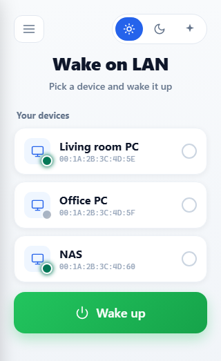
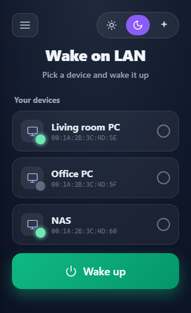
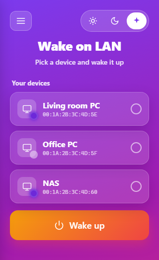
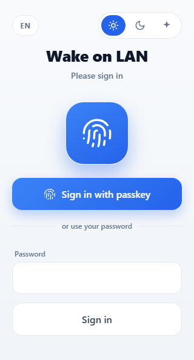
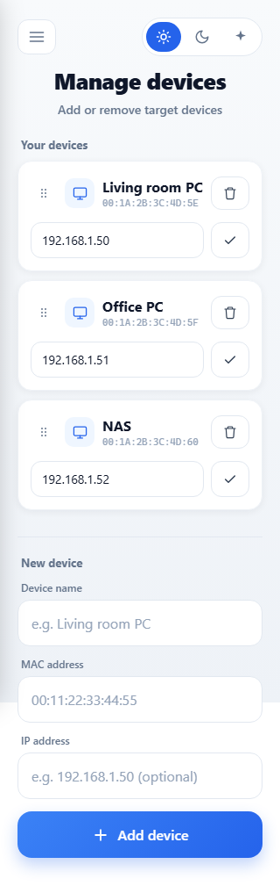
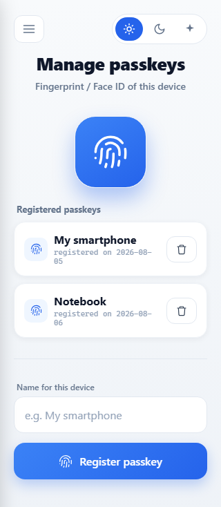
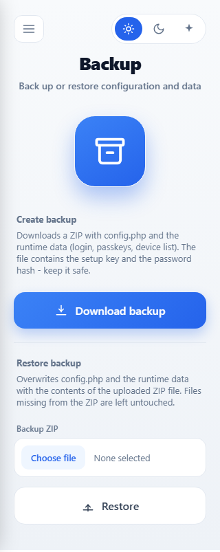

# WOL with passkey login

*[Deutsche Version](README.md)*

A lean Wake-on-LAN web interface for home use – with a modern
**passkey login (fingerprint / Face ID)** instead of just a password. One folder
of PHP, no database, no Composer, no build tools: upload it, set a password, done.

From your phone: open the page → touch the sensor → wake the machine.

## Screenshots

Three switchable themes (**Light** is the default):

| Light | Dark | Vivid |
|:---:|:---:|:---:|
|  |  |  |

| Passkey login | Manage devices | Manage passkeys | Backup |
|:---:|:---:|:---:|:---:|
|  |  |  |  |

## Features

- 🖥️ **Wake on LAN**: wakes machines on your home network via magic packet (UDP broadcast,
  sent to several addresses and ports for reliability); if an IP is stored, the page
  then tells you as soon as the device is reachable
- 🔐 **Login protection**: password login with lockout after too many failed attempts
- 👆 **Passkeys (WebAuthn)**: sign in with fingerprint/Face ID, registered per device;
  on known devices the prompt starts automatically when the page opens - this
  can be switched off per device if you prefer the password there
- 🎨 **Three themes**: Light, Dark and Vivid – switchable any time via the toggle in
  the top right; the choice is remembered per browser
- 🌍 **Multilingual**: German, English, French and Spanish, switchable from the hamburger
  menu; on your first visit the browser language is detected. More languages are easy
  to add (see [Adding a language](#adding-a-language))
- 📱 **Optimised for phones**: large buttons, tappable device tiles, navigation in a
  hamburger menu
- ⚙️ **Device management in the browser**: add, edit and remove target devices
  (name, MAC, IP) without editing files
- ⏰ **Scheduled wake-ups**: set a time and weekdays per device, e.g. Mon–Fri
  at 07:30. Nothing happens if the device is already running
  (requires the [background check](#background-check))
- 📜 **History**: who woke which device when, sign-ins and failed attempts,
  online/offline changes and changes to devices and passkeys
- ⏱️ **Uptime display**: every device tile shows how long the device has been
  running or off (precise once the [background check](#background-check) is set up)
- 💾 **Backup & restore**: download configuration and runtime data as a ZIP and
  restore it whenever needed
- 🔁 **Reverse-proxy friendly**: works behind common reverse proxies
  (Nginx Proxy Manager, Traefik, Caddy, the reverse proxy in Synology DSM, etc.)
- 🗂️ **No database**: all data lives in self-protecting files in the `auth/` folder

## Requirements

- PHP **8.0 or newer** with the **openssl** and **sockets** extensions
  (no mbstring, no Composer needed)
- A web server (Apache, nginx, Caddy, … – or a ready-made package such as
  XAMPP, a Docker PHP image, or the Web Station of a NAS)
- **HTTPS** with a valid certificate – without HTTPS the browser refuses passkeys
- The server must be **on the same LAN** as the machines you want to wake
  (magic packets are broadcasts and do not leave the local network – so rented
  web space on the internet will not work)
- Docker: only with `network_mode: host`, otherwise the broadcasts never reach your LAN

## Installation

> **Tip:** The easiest way is to download the ready-made installation ZIP from the
> [releases page](https://github.com/brunoz78/wol-passkey/releases/latest)
> (`wol-passkey-<version>.zip`). It contains only the files needed to run the app –
> no screenshots, no development files. The "Source code" download, by contrast,
> contains the whole project and is not needed for installation.

1. Download the installation ZIP, extract it and upload the **contents** of the
   folder to a directory on your web server
2. Copy `config.sample.php` to `config.php` and adjust it:
   - `$setup_key`: **enter your own long random value** (e.g. from your password
     manager). Anyone who knows this key can reset the login password – keep it secret!
   - `$networkbroadcast`: the broadcast address of your home network
     (network `192.168.1.x` → `192.168.1.255`)
   - `$maclist`: optionally add your first target devices (they can be managed
     comfortably through the web interface later)
3. Give the web server user **write permission on the `auth/` folder**
   (on Linux e.g. `chown www-data auth/` or `chmod`; on a NAS use the file manager
   to grant read/write access to the web user, usually group `http`)
4. Open `https://your-domain/setup.php`, enter the setup key and set a login password
5. Sign in and register this device's fingerprint under **"Manage passkeys"** –
   from then on you can sign in without a password

### On Proxmox: LXC via script

On a Proxmox host there is a shortcut. A single call on the host shell creates
a Debian container with nginx and PHP-FPM, installs the app, generates a random
setup key and derives the broadcast address from the container's own subnet:

```bash
COMMUNITY_SCRIPTS_URL=https://raw.githubusercontent.com/brunoz78/ProxmoxVED/main bash -c "$(curl -fsSL https://raw.githubusercontent.com/brunoz78/ProxmoxVED/main/ct/wol-passkey.sh)"
```

The setup key is printed at the end; continue with step 4 above. Later updates
are done by running `update` inside the container. The
[background check](#background-check) is already set up in the container.

The script builds on the [community-scripts](https://community-scripts.org)
framework, but lives in a personal fork and is **not** part of the official
collection. Details: [`proxmox/README.md`](proxmox/README.md).

## Background check

For the app to know how long a device has been running or off, and to run
scheduled wake-ups, `cron.php` has to run once a minute – even when nobody has
the page open. Without it,
the status is only recorded on page visits; the tiles then show
"since … at the latest", and the history page points this out.

- **Proxmox LXC** (script above): already set up, as the systemd timer
  `wol-passkey-check.timer`
- **Linux server, VM, Raspberry Pi:** add it to the web server user's crontab,
  e.g. with `sudo crontab -u www-data -e`:

  ```
  * * * * * php /var/www/wol-passkey/cron.php
  ```
- **NAS with a task scheduler** (e.g. Synology DSM): create a recurring task
  with the same command, ideally as the web server user (`http` on Synology).
  Depending on the PHP package the command may be e.g. `php82` instead of `php`.
- **Docker:** via cron on the host, e.g.
  `* * * * * docker exec -u www-data <container> php /var/www/html/cron.php`

**Do not run it as root:** otherwise the data files in `auth/` end up owned by
root and the web page can no longer change them. `cron.php` refuses to start
in that case.

**Check the time zone:** without a setting PHP often runs on UTC, so a
schedule of "07:30" would fire at 09:30 in Central Europe. The "Schedule"
page shows the server time at the bottom. If it is wrong, set
`$timezone = "Europe/Zurich";` in `config.php` (empty = the server's own
time zone).

## Updating

After signing in, the app automatically shows a notice once a newer version
has been published on GitHub (checked at most once a day, purely
informational – nothing is downloaded or installed automatically). Clicking
the notice opens the
[releases page](https://github.com/brunoz78/wol-passkey/releases/latest).

To update manually:

1. Download the new installation ZIP from the releases page and extract it
2. Upload the **contents** of the folder to your web server, overwriting all
   existing files
3. Done – `config.php` and the self-generated data in `auth/` (`data.php`,
   `devices-data.php`, `log-data.php`, `status-data.php`) are **not** included
   in the installation ZIP and stay untouched; your login password, passkeys,
   device list and history are preserved

It's worth checking [CHANGELOG.md](CHANGELOG.md) before updating.

## Backup & restore

The hamburger menu's **"Backup"** page lets you download `config.php` and the
runtime data (login password, passkeys, device list) as a ZIP file – handy
before an update, a server move, or just as a safety net. The ZIP contains the
setup key and the password hash, so keep it somewhere safe.

The same page can restore a previously downloaded ZIP; if it only contains
some of the files, the rest are left untouched. This requires the PHP
extension `zip` – if it's missing, the page shows a notice.

## Running behind a reverse proxy

Passkeys are bound to the domain shown in the browser. For the server to know that
domain, the proxy has to pass along two headers:

**Nginx Proxy Manager** (custom location or the Advanced tab):

```nginx
location / {
    proxy_pass http://192.168.1.10/wol/;
    proxy_set_header X-Forwarded-Host $host;
    proxy_set_header X-Forwarded-Proto $scheme;
}
```

Set the same two headers on other reverse proxies. Example for **Synology DSM**:
Control Panel → Login Portal → Advanced → Reverse Proxy → edit the entry →
Custom Header → `X-Forwarded-Host` = `$host` and `X-Forwarded-Proto` = `$scheme`.

Without these headers, registering a passkey fails with the error
*"The relying party ID is not a registrable domain suffix of, nor equal to the
current domain"*.

**Important:** a passkey is only valid for the domain it was registered on. So always
open the page through the same address (bookmark it!).

## Security notes

- The application is deliberately a **single-user system** for home use:
  one shared password, one shared passkey list – no user accounts, no roles
- Never publish `config.php` (it contains the setup key); it is therefore listed
  in `.gitignore`
- The data files in `auth/` (password hash, passkey keys, device list) protect
  themselves against direct web access (403). The bundled `.htaccess` files block
  the folders on Apache as well; on nginx the equivalent is:

  ```nginx
  location ~ ^/(auth|lib|lang)/ { deny all; }
  ```

- After 5 wrong password attempts the login is locked for 5 minutes
  (configurable in `auth/config.php`)
- Forgot the password? Open `setup.php` and set a new one using the setup key

## Adding a language

The texts live as plain PHP arrays in the `lang/` folder. A new language needs no
code changes in the pages:

1. Copy `lang/de.php` to `lang/<code>.php` (e.g. `lang/fr.php`)
2. Translate the texts to the right of the `=>`
3. Add the code to `i18n_languages()` in `auth/i18n.php`:

   ```php
   return [
       'de' => 'Deutsch',
       'en' => 'English',
       'fr' => 'Français',
   ];
   ```

If a text is missing from a language file, the German one is used automatically
(German is the source language). The chosen language is remembered in a cookie; on
the first visit the browser language decides, otherwise English is used.

## Building the release ZIP yourself

The installation ZIP (only the files needed to run the app) is produced by a bundled
script – cross-platform, with correct forward slashes (which matters when extracting
on Linux/NAS):

```bash
php tools/build-release.php 1.1.0
```

Result: `dist/wol-passkey-1.1.0.zip`. The script automatically excludes the secret
`config.php`, screenshots and development files, and aborts if a secret would end up
in the archive by accident. The version number in the file name is the argument.

Then attach it to a GitHub release – either through the web interface
(*Releases → Draft/Edit release → drop the file into the "Attach binaries" field*)
or from the command line:

```bash
gh release create v1.1.0 dist/wol-passkey-1.1.0.zip --title "v1.1.0" --notes "…"
# or attach it to an existing release:
gh release upload v1.1.0 dist/wol-passkey-1.1.0.zip
```

## Credits

- Original WOL script: © 2014 [Barry Schiffer](http://www.barryschiffer.com),
  extended by Manuel Azevedo
- WebAuthn library: [lbuchs/WebAuthn](https://github.com/lbuchs/WebAuthn)
  (MIT licence, included in the `lib/webauthn/` folder)
- Icon: Streamline Icons Free Pack via Iconfinder

## Licence

MIT – see [LICENSE](LICENSE).
